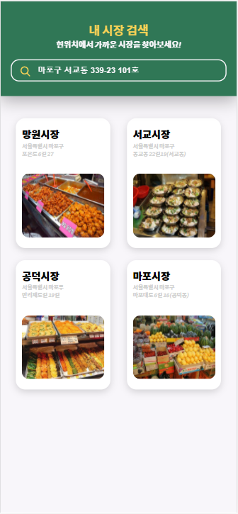
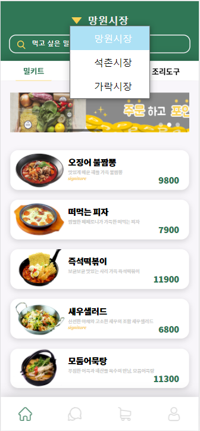
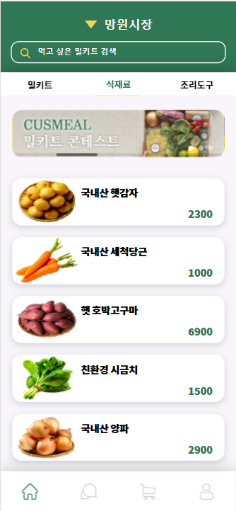
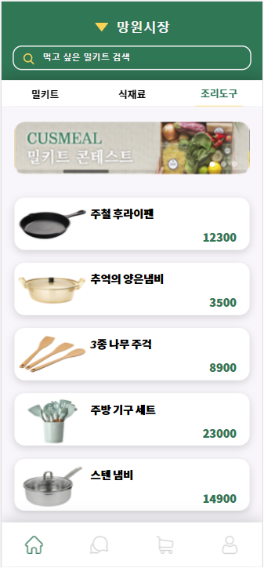
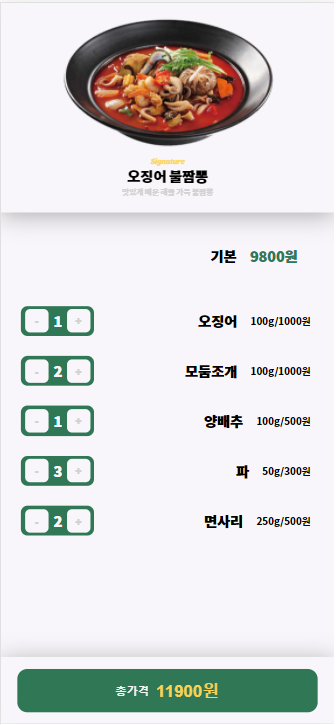
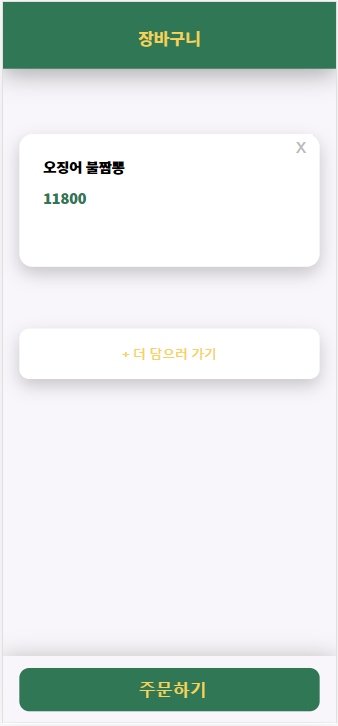
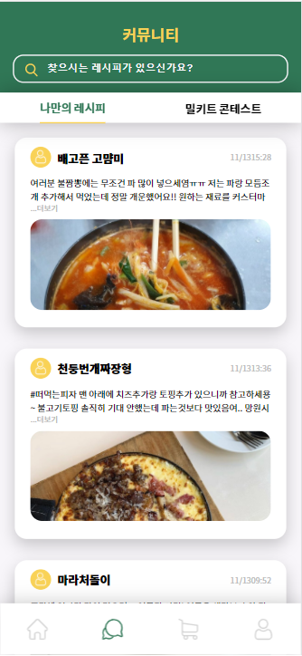
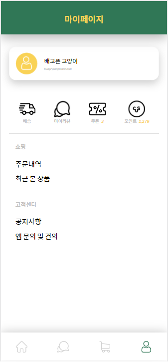

# cusmeal

   

### 🤷‍ 제작 동기

  전통시장 식자재를 이용하여 나만의 맞춤 밀키트 제작하기! 
  가격은 싸게, 재료는 신선하게.

### 📷 스크린샷

### 🎥 영상
 
이미지를 클릭해주세요!

### 💻 구현 내용
- **Language**: JavaScript
- **Framework & Library** : React.js, Redux, axios, styled_components, swiper
- **반응형으로 구현**

전체적인 구성
> * 하단 메뉴바와 장바구니에 담긴 항목, 상세 페이지에서 추가 재료 선택 등은 redux를 이용하여 관리
> * axios를 이용하여 서버로 부터 정보 받아오거나 서버에 추가 데이터 등록 및 삭제
> * router를 이용하여 여려 페이지 관리
0. 로딩 페이지
> * styled_components와 setInterval 함수 사용하여 2초 뒤 사라지는 로딩 페이지 구현
1. 시장 검색 페이지
> * 검색창 구현
> * 서버로 부터 시장 목록 불러오기
2. 메인 페이지
> * 시장 목록에서 시장 변경 구현
> * 검색창 구현
> * swiper 사용하여 이미지 슬라이더로 광고 배너 구현. 
시간이 지나면 자동으로 다음 광고로 넘어감.
> * grid 사용하여 목록 구현
> * 상단의 메뉴바에 따라 서버로 부터 밀키트, 식재료, 조리도구 목록을 불러 올 수 있도록 구현
3. 상세 페이지
> * redux를 이용하여 추가 재료 선택 여부에 따라 결제 버튼의 가격 표시도 함께 변화하도록 구현
> * 결제 버튼 클릭 시 해당 항목 정보 서버에 추가
4. 커뮤니티 페이지
> * 서버로 부터 게시물 목록 불러오기
> * grid 사용하여 목록 구현
5. 장바구니 페이지
> * x 아이콘 클릭 시 해당 항목 서버에서 삭제
> * '더 담으러 가기' 버튼 클릭시 메인 페이지의 밀키트 부분으로 페이지 이동
6. 마이페이지
> * styled_components로 구현
